# Torch9 Technical Architecture

## Overview

Torch9 implements a revolutionary cognitive computing architecture that integrates **membrane computing** with neural substrates through the **P9ML (P9 Membrane Layer)** system. This document provides a comprehensive technical overview of the system components, data flow, design principles, and architectural patterns.

## Table of Contents

- [Core Principles](#core-principles)
- [System Architecture](#system-architecture)
- [Component Details](#component-details)
- [Data Flow](#data-flow)
- [Cognitive Grammar](#cognitive-grammar)
- [Hypergraph Topology](#hypergraph-topology)
- [Evolution and Meta-Learning](#evolution-and-meta-learning)
- [Performance Considerations](#performance-considerations)
- [Extension Points](#extension-points)

## Core Principles

### 1. Membrane Computing Paradigm

The P9ML system is based on membrane computing (P systems), where computation occurs within hierarchical membrane structures. Each neural module is wrapped in a **computational membrane** that:

- Maintains local state and evolution rules
- Communicates through membrane boundaries
- Evolves based on fitness and adaptation rules
- Participates in global cognitive processes

### 2. Cognitive Grammar through Prime Factorization

Tensor shapes are analyzed through prime factorization to create **dimensional lexemes** - fundamental cognitive units that enable:

- Similarity comparison between different tensor operations
- Hierarchical organization of computational patterns
- Emergent cognitive vocabulary development
- Mathematical foundations for cognitive relationships

### 3. Emergent Global Coherence

Local membrane interactions create emergent global behaviors through:

- **Gestalt synthesis**: Coherent field emergence from distributed activities
- **Hypergraph topology**: Dynamic relationship formation
- **Collective intelligence**: System-wide pattern recognition
- **Adaptive organization**: Self-optimizing cognitive structure

## System Architecture

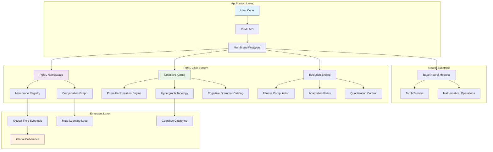

## Component Details

### P9ML Core Components

#### 1. P9ML Main Module (`P9ML.lua`)

**Purpose**: Central integration and API layer

**Key Responsibilities**:
- System initialization and configuration
- High-level API for membrane creation
- Global state management
- Convenience functions for common operations

**Key Functions**:
```lua
P9ML.init(config)           -- Initialize the system
P9ML.wrapModule(module)     -- Wrap neural module in membrane
P9ML.Linear(in, out, cfg)   -- Create linear membrane layer
P9ML.Conv2d(...)            -- Create convolutional membrane layer
P9ML.status()               -- Get system status
P9ML.synthesize()           -- Trigger gestalt synthesis
```

#### 2. P9ML Membrane (`P9MLMembrane.lua`)

**Purpose**: Core computational membrane wrapper

**Architecture**:
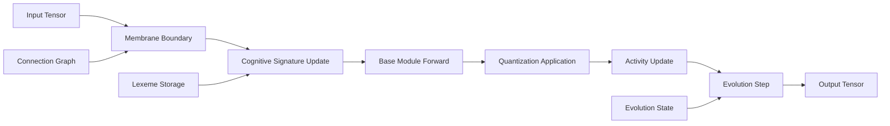

**Key Properties**:
- `id`: Unique membrane identifier
- `baseModule`: Wrapped neural module
- `lexeme`: Current cognitive signature
- `evolution_state`: Adaptation parameters
- `cognitive_signature`: Computed identity hash
- `activity_level`: Current processing intensity
- `connections`: Inter-membrane relationships

**Evolution Mechanisms**:
- **Gradient Evolution**: Evolutionary pressure on learning dynamics
- **Quantization Adaptation**: Dynamic precision optimization
- **Fitness Tracking**: Performance-based adaptation
- **Activity Monitoring**: Processing intensity tracking

#### 3. P9ML Namespace (`P9MLNamespace.lua`)

**Purpose**: Central registry and orchestration system

**Data Structures**:
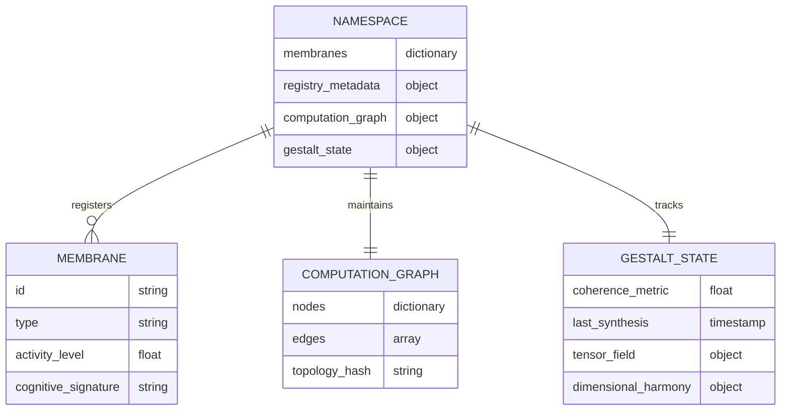

**Key Functions**:
- **Membrane Registration**: Central tracking of all membranes
- **Similarity Computation**: Cognitive similarity between membranes
- **Gestalt Synthesis**: Global field computation from local activities
- **Graph Management**: Computation topology maintenance

#### 4. Cognitive Kernel (`P9MLCognitiveKernel.lua`)

**Purpose**: Hypergraph topology and cognitive grammar management

**Hypergraph Structure**:
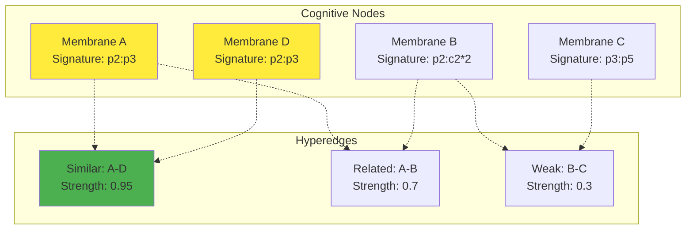

**Grammar Categories**:
- **Scalar**: `p1` (1D, single element)
- **Vector**: `pN` (1D, N elements)
- **Matrix**: `pN:pM` (2D, N×M elements)
- **Tensor**: `pN:pM:pL...` (3D+, N×M×L... elements)

**Prime Factorization Engine**:
```lua
-- Example: 8×6 matrix
-- Shape: [8, 6] 
-- Factors: [2,2,2] × [2,3]
-- Signature: "c2*2*2:c2*3"
-- Category: "matrix"
```

### Data Flow Architecture

#### Forward Pass Flow

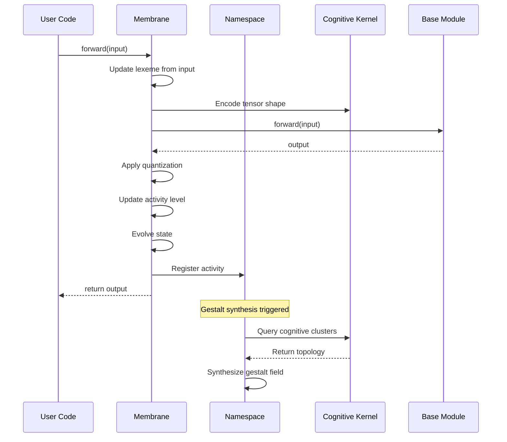

#### Cognitive Processing Pipeline

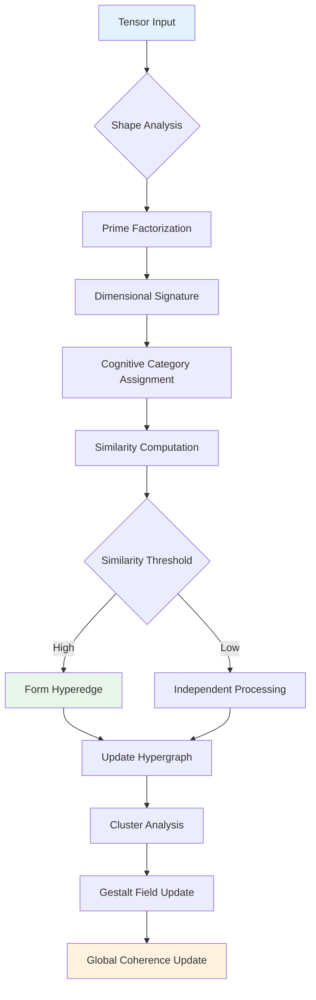

## Cognitive Grammar

### Prime Factorization System

The cognitive grammar is built on mathematical foundations using prime factorization of tensor dimensions:

**Examples**:
```
2×2 matrix    : [2] × [2]         → p2:p2
3×4 matrix    : [3] × [2,2]       → p3:c2*2  
8×6×4 tensor  : [2,2,2] × [2,3] × [2,2] → c2*2*2:c2*3:c2*2
```

**Cognitive Categories**:
1. **Simple Primes** (`p`): Pure mathematical structures (p2, p3, p5, p7...)
2. **Composite Primes** (`c`): Complex factorizations (c2*3, c2*2*5...)
3. **Dimensional Patterns**: Multi-dimensional combinations

### Similarity Metrics

**Cognitive Similarity Computation**:
```lua
function computeCognitiveSimilarity(sig1, sig2)
    local category_bonus = (sig1.category == sig2.category) and 0.2 or 0.0
    local prime_overlap = computePrimeOverlap(sig1.factors, sig2.factors)
    local dimension_similarity = computeDimensionalSimilarity(sig1.shape, sig2.shape)
    
    return (prime_overlap + dimension_similarity + category_bonus) / 3.0
end
```

**Similarity Categories**:
- **Identical**: 1.0 (exact same signature)
- **Highly Similar**: 0.8-0.99 (same category, similar factors)
- **Related**: 0.5-0.79 (overlapping factors or categories)
- **Weakly Related**: 0.2-0.49 (minimal overlap)
- **Unrelated**: 0.0-0.19 (no significant similarity)

## Hypergraph Topology

### Node Representation

Each membrane becomes a node in the cognitive hypergraph:

```lua
node = {
    id = membrane_id,
    cognitive_signature = "p2:c2*3",
    category = "matrix",
    activity_level = 0.75,
    shape = {2, 6},
    factors = {{2}, {2, 3}},
    connections = {...}
}
```

### Hyperedge Formation

Hyperedges form between cognitively similar membranes:

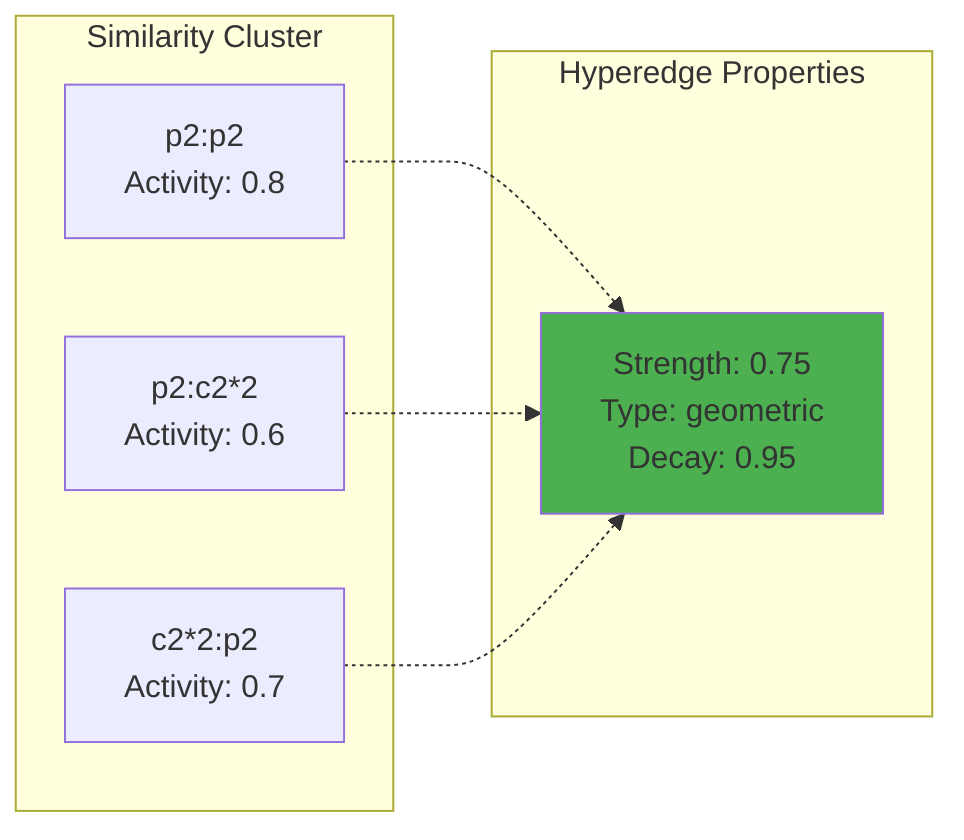

### Cluster Dynamics

**Cluster Formation**:
1. **Similarity Threshold**: Minimum 0.3 for edge formation
2. **Activity Weighting**: Higher activity membranes become cluster centers
3. **Temporal Decay**: Edge strength decreases over time without reinforcement
4. **Dynamic Reorganization**: Clusters adapt based on new patterns

## Evolution and Meta-Learning

### Membrane Evolution

Each membrane evolves according to fitness-based rules:

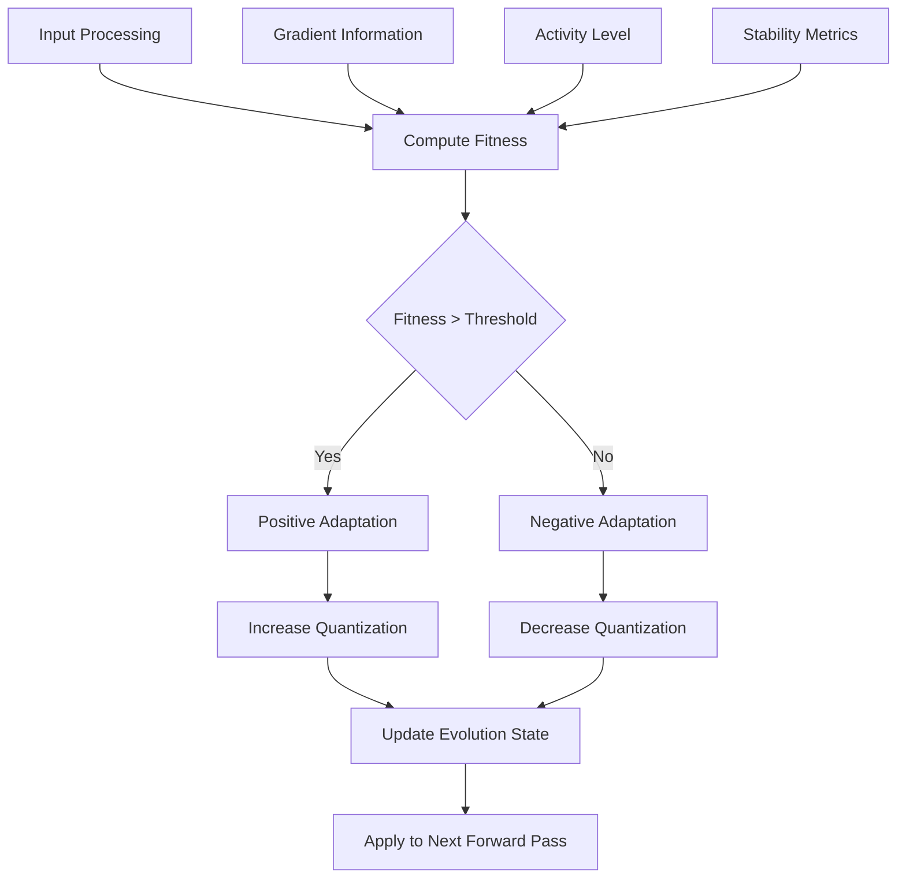

**Fitness Function**:
```lua
function computeFitness(membrane, input, output)
    local stability = 1.0 - math.abs(output:norm() - input:norm()) / input:norm()
    local activity_factor = math.min(membrane.activity_level, 1.0)
    return activity_factor * stability
end
```

**Adaptation Rules**:
- **Quantization**: Adapts based on fitness (higher fitness → higher precision)
- **Learning Rate**: Modulated by evolution state
- **Gradient Decay**: Applied to maintain learning momentum
- **Connection Strength**: Influenced by successful collaborations

### Meta-Learning Loop

The system implements meta-learning through continuous topology adaptation:

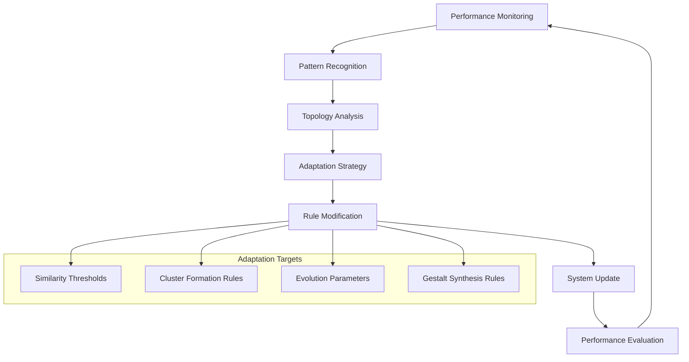

## Gestalt Field Synthesis

### Field Computation

The gestalt tensor field represents the global cognitive state:

```lua
gestalt_field = {
    components = field_components,           -- Active membrane contributions
    synthesis_time = os.time(),             -- When field was computed
    field_energy = total_energy,            -- Sum of component energies
    coherence = coherence_metric,           -- Global harmony measure
    dimensional_summary = dim_summary       -- Statistical overview
}
```

**Energy Computation**:
```lua
function computeFieldEnergy(components)
    local total_energy = 0.0
    for _, comp in ipairs(components) do
        local dim_complexity = 1.0
        for _, dim_size in ipairs(comp.shape) do
            dim_complexity = dim_complexity * math.log(dim_size + 1)
        end
        total_energy = total_energy + comp.activity * dim_complexity
    end
    return total_energy
end
```

### Coherence Metrics

**Global Coherence**:
- **Activity Variance**: Measures harmony across membrane activities
- **Signature Diversity**: Entropy of cognitive signature distribution
- **Temporal Stability**: Consistency of field properties over time
- **Dimensional Harmony**: Balance of different tensor categories

```mermaid
graph LR
    subgraph "Coherence Factors"
        A[Activity Variance<br/>σ² < 0.1 = High]
        B[Signature Diversity<br/>H(S) ∈ [0,1]]
        C[Temporal Stability<br/>Δt correlation]
        D[Dimensional Harmony<br/>Category balance]
    end
    
    A --> E[Global Coherence<br/>exp(-variance)]
    B --> E
    C --> E
    D --> E
    
    style E fill:#fff3e0
```

## Performance Considerations

### Computational Complexity

**Time Complexity**:
- **Prime Factorization**: O(√n) per dimension
- **Similarity Computation**: O(m²) for m membranes
- **Hypergraph Update**: O(m + e) for m nodes, e edges
- **Gestalt Synthesis**: O(m × d) for m membranes, d dimensions

**Space Complexity**:
- **Membrane Storage**: O(m) for m membranes
- **Hypergraph Topology**: O(m²) worst case for dense connections
- **Cognitive Signatures**: O(m × k) for k average signature length
- **Gestalt Field**: O(f) for f field components

### Optimization Strategies

1. **Cognitive Caching**: Memoize frequently computed similarities
2. **Lazy Evaluation**: Compute gestalt fields only when needed
3. **Threshold Pruning**: Remove weak connections below threshold
4. **Batch Processing**: Group similar operations for efficiency
5. **Incremental Updates**: Update only changed components

### Memory Management

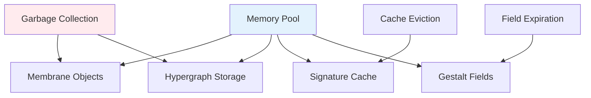

## Extension Points

### 1. Custom Membrane Types

Extend the system with specialized membrane implementations:

```lua
local CustomMembrane = {}
setmetatable(CustomMembrane, {__index = P9MLMembrane})

function CustomMembrane:forward(input)
    -- Custom processing logic
    local result = P9MLMembrane.forward(self, input)
    -- Additional custom operations
    return result
end
```

### 2. Alternative Cognitive Grammars

Replace or extend the prime factorization grammar:

```lua
function P9MLCognitiveKernel:addGrammarRule(name, rule)
    self.grammar_rules[name] = {
        pattern = rule.pattern,
        cognitive_weight = rule.cognitive_weight,
        interaction_range = rule.interaction_range,
        category_function = rule.category_function
    }
end
```

### 3. Custom Evolution Rules

Implement domain-specific evolution strategies:

```lua
function CustomEvolutionRules(membrane, fitness, input, output)
    -- Custom fitness computation
    local custom_fitness = computeCustomFitness(membrane, input, output)
    
    -- Custom adaptation logic
    return {
        quantization_delta = custom_fitness * 0.01,
        learning_rate_factor = 1.0 + custom_fitness,
        connection_strength_delta = custom_fitness * 0.05
    }
end
```

### 4. External System Integration

Connect with other frameworks and systems:

```lua
-- PyTorch integration example
function P9ML.exportToPyTorch(membranes)
    local torch_modules = {}
    for _, membrane in ipairs(membranes) do
        torch_modules[membrane.id] = convertToTorchModule(membrane)
    end
    return torch_modules
end

-- GGML kernel integration
function P9ML.compileToGGML(gestalt_field)
    local ggml_ops = {}
    for _, component in ipairs(gestalt_field.components) do
        table.insert(ggml_ops, compileComponentToGGML(component))
    end
    return ggml_ops
end
```

### 5. Visualization and Monitoring

Add real-time monitoring and visualization:

```lua
function P9ML.visualizeTopology(format)
    local graph_data = {
        nodes = P9ML.cognitive_kernel:getNodes(),
        edges = P9ML.cognitive_kernel:getHyperedges(),
        clusters = P9ML.cognitive_kernel:getCognitiveClusters()
    }
    
    if format == "graphviz" then
        return exportToGraphviz(graph_data)
    elseif format == "d3" then
        return exportToD3(graph_data)
    end
end
```

## Future Architecture Enhancements

### 1. Distributed Membrane Computing

Extend to multiple nodes and distributed processing:

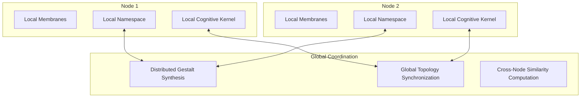

### 2. Neuromorphic Hardware Support

Optimize for neuromorphic computing platforms:

- **Spike-based Processing**: Convert to spike trains for neuromorphic chips
- **Memristive Storage**: Use memristive elements for cognitive signatures
- **Parallel Evolution**: Leverage massive parallelism for evolution
- **Energy Efficiency**: Optimize for low-power operation

### 3. Quantum-Inspired Extensions

Incorporate quantum computing principles:

- **Superposition States**: Multiple cognitive signatures simultaneously
- **Entanglement**: Quantum correlations between distant membranes
- **Quantum Interference**: Constructive/destructive pattern interactions
- **Quantum Annealing**: Optimization of hypergraph topology

---

This architecture provides a solid foundation for cognitive computing research while maintaining extensibility and performance. The membrane computing paradigm creates emergent intelligence through local interactions, making the system both theoretically grounded and practically powerful.