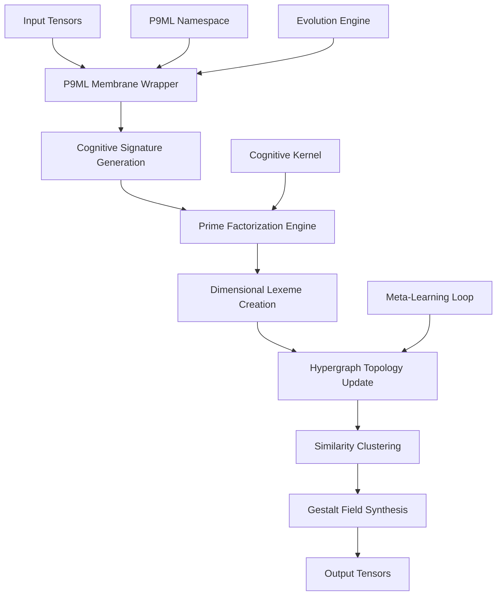

# Torch9 with P9ML Membrane Computing

[](https://gitter.im/torch/torch7?utm_source=badge&utm_medium=badge&utm_campaign=pr-badge&utm_content=badge)
[](https://travis-ci.org/torch/torch7)

## Overview

Torch9 is an enhanced deep learning framework that extends the classical Torch7 library with **P9ML (P9 Membrane Layer)** - a revolutionary cognitive computing system that implements membrane computing paradigms within neural substrates. This integration creates emergent agentic cognitive grammar through prime factorization of tensor shapes, hypergraph topology, and gestalt tensor field synthesis.

### What Makes Torch9 Different

- **Membrane Computing Integration**: Neural modules are wrapped in computational membranes that evolve and adapt
- **Cognitive Grammar**: Tensor shapes are analyzed through prime factorization to create dimensional lexemes
- **Hypergraph Topology**: Automatic similarity clustering and cognitive relationship mapping
- **Gestalt Synthesis**: Coherent tensor field emergence from distributed membrane activities
- **Meta-Learning**: Evolution rules and fitness functions for adaptive behavior
- **Relevance Realization**: Frame problem resolution through selective attention and cognitive clustering

## Key Features

### 🧠 P9ML Membrane Computing System
- **Membrane Wrappers**: Transform any neural module into an adaptive cognitive membrane
- **Cognitive Signatures**: Unique identifiers based on tensor prime factorization
- **Evolution Engine**: Adaptive quantization and fitness-based optimization
- **Namespace Registry**: Centralized orchestration of distributed membrane computation

### 🔗 Hypergraph Cognitive Topology
- **Similarity Clustering**: Automatic grouping of cognitively similar membranes
- **Cognitive Grammar Catalog**: Living documentation of emergent dimensional patterns
- **Hyperedge Formation**: Dynamic connection creation based on cognitive similarity
- **Gestalt Field Synthesis**: Coherent global state emergence from local interactions

### 🎯 Relevance Realization Engine
- **Selective Attention**: High-activity membranes receive processing priority
- **Frame Problem Resolution**: Efficient relevance determination in complex spaces
- **Adaptive Hierarchy**: Self-organizing cognitive structure optimization
- **Meta-Learning Loops**: Continuous topology adaptation and improvement

### 🔬 Advanced Neural Operations
- **Quantization Adaptation**: Dynamic precision optimization based on performance
- **Gradient Evolution**: Evolutionary pressure applied to learning dynamics
- **Cognitive Caching**: Memoized computation for repeated similarity patterns
- **Tensor Field Operations**: Advanced mathematical operations on gestalt structures

## Installation

### Prerequisites

- CMake 2.8 or higher
- C compiler (GCC, Clang, or MSVC)
- Lua 5.1/5.2/5.3 or LuaJIT
- Git

### Quick Install

```bash
# Clone the repository
git clone https://github.com/HyperCogWizard/torch9.git
cd torch9

# Build with CMake
mkdir build && cd build
cmake .. 
make -j$(nproc)

# Install (optional)
make install
```

### From Source

```bash
# Prerequisites on Ubuntu/Debian
sudo apt-get install cmake libreadline-dev git-core libqt4-dev libjpeg-dev libpng-dev ncurses-dev imagemagick libzmq3-dev gfortran unzip gnuplot gnuplot-x11

# Prerequisites on CentOS/RHEL
sudo yum install cmake readline-devel git qt4-devel libjpeg-devel libpng-devel ncurses-devel ImageMagick zeromq3-devel gcc-gfortran gnuplot

# Build
git clone https://github.com/HyperCogWizard/torch9.git
cd torch9
mkdir build && cd build
cmake ..
make
```

## Quick Start

### Basic P9ML Usage

```lua
-- Initialize the P9ML system
local P9ML = require('P9ML')
P9ML.init()

-- Create membrane-wrapped neural modules
local linear1 = P9ML.Linear(784, 128, {
    initial_quantization = 0.9,
    adaptation_rate = 0.02,
    gradient_decay = 0.98
})

local linear2 = P9ML.Linear(128, 10, {
    initial_quantization = 0.8,
    adaptation_rate = 0.01
})

-- Connect membranes to form computation graph
linear1:connectTo(linear2)

-- Process tensors through membrane network
local input = torch.randn(784)
local hidden = linear1:forward(input)
local output = linear2:forward(hidden)

-- Analyze cognitive state
local status = P9ML.status()
print("Membranes:", status.membranes.total)
print("Gestalt coherence:", status.gestalt.coherence)

-- Synthesize gestalt field
local gestalt_field = P9ML.synthesize()
print("Field energy:", gestalt_field.field_energy)
```

### Cognitive Grammar Analysis

```lua
-- Examine dimensional lexemes
local lexeme = linear1:getLexeme()
print("Cognitive signature:", lexeme.gestalt_signature)
print("Prime factors:", table.concat(lexeme.dimensional_signature, " | "))

-- Find similar membranes
local membranes = P9ML.getMembranes()
local similarity = P9ML.getCognitiveSimilarity(membranes[1], membranes[2])
print("Cognitive similarity:", similarity)

-- Analyze evolution state
local evolution = linear1:getEvolutionState()
print("Generation:", evolution.generation)
print("Fitness:", evolution.fitness)
print("Quantization level:", evolution.quantization_level)
```

### Advanced Features

```lua
-- Custom membrane configuration
local conv = P9ML.Conv2d(3, 64, 3, {
    initial_quantization = 0.85,
    adaptation_rate = 0.015,
    quantization_threshold = 0.1,
    fitness_momentum = 0.9
})

-- Manual cognitive kernel operations
P9ML.cognitive_kernel:encodeTensorShape({2, 3, 4}, "custom_membrane")
local clusters = P9ML.cognitive_kernel:getCognitiveClusters()
local encodings = P9ML.cognitive_kernel:queryEncodingsByCategory("tensor")

-- Gestalt field analysis
local field_components = gestalt_field.components
for _, comp in ipairs(field_components) do
    print(string.format("Shape: %s, Activity: %.3f", 
                       table.concat(comp.shape, "x"), comp.activity))
end
```

## Documentation

### Core Documentation
- [Technical Architecture](ARCHITECTURE.md) - System components and design principles
- [P9ML API Reference](doc/p9ml-api.md) - Complete API documentation
- [Cognitive Grammar Catalog](P9ML_Cognitive_Grammar_Catalog.md) - Living documentation of cognitive patterns

### Torch7 Legacy Documentation
- [Tensor Operations](doc/tensor.md) - Multi-dimensional tensor operations
- [Mathematical Functions](doc/maths.md) - Mathematical operations on tensors
- [File I/O](doc/file.md) - File operations and serialization
- [Testing Framework](doc/tester.md) - Unit testing utilities
- [Command Line Interface](doc/cmdline.md) - CLI argument parsing

### Examples and Tutorials
- [P9ML Demo](p9ml_demo.lua) - Complete demonstration of membrane computing
- [Basic Tutorial](examples/basic_tutorial.lua) - Getting started with P9ML
- [Advanced Patterns](examples/advanced_patterns.lua) - Complex cognitive architectures

## Architecture Overview



The system creates a cognitive computing layer that:

1. **Wraps neural modules** in adaptive membranes
2. **Analyzes tensor shapes** through prime factorization
3. **Creates cognitive signatures** for similarity comparison
4. **Forms hypergraph topology** for relationship mapping
5. **Synthesizes gestalt fields** for coherent global state
6. **Evolves and adapts** through fitness-based optimization

## Use Cases

### Research Applications
- **Cognitive Computing Research**: Novel approaches to artificial cognition
- **Membrane Computing**: Practical implementation of P systems
- **Meta-Learning**: Self-adaptive neural architectures
- **Computational Consciousness**: Relevance realization and frame problem research

### Practical Applications
- **Adaptive Neural Networks**: Self-optimizing deep learning models
- **Cognitive Architectures**: Brain-inspired computing systems
- **Multi-Agent Systems**: Distributed cognitive coordination
- **Intelligent Optimization**: Evolutionary neural architecture search

### Educational Use
- **Advanced AI Courses**: Teaching cognitive computing principles
- **Research Training**: Hands-on membrane computing experience
- **Computational Biology**: Bio-inspired computing paradigms
- **Philosophy of Mind**: Computational consciousness exploration

## Contributing

We welcome contributions to Torch9 and the P9ML system! Please see our [Contribution Guidelines](CONTRIBUTING.md) for details.

### Development Areas

- **Core P9ML System**: Enhance membrane computing capabilities
- **Cognitive Grammar**: Expand dimensional pattern recognition
- **Performance Optimization**: Improve efficiency and scalability
- **Documentation**: Enhance tutorials and examples
- **Testing**: Expand test coverage and validation
- **Integration**: Connect with modern deep learning frameworks

### Getting Started

1. Fork the repository
2. Create a feature branch (`git checkout -b feature/amazing-feature`)
3. Run the test suite (`lua run_p9ml_tests.lua`)
4. Make your changes and add tests
5. Commit your changes (`git commit -m 'Add amazing feature'`)
6. Push to the branch (`git push origin feature/amazing-feature`)
7. Open a Pull Request

## Community and Support

### Getting Help

- **GitHub Issues**: Report bugs and request features
- **Discussions**: Join community discussions and ask questions
- **Documentation**: Check the comprehensive documentation
- **Examples**: Explore the examples directory for usage patterns

### Community Channels

- **Gitter Chat**: [torch/torch7](https://gitter.im/torch/torch7) (legacy Torch7 community)
- **Research Papers**: Academic publications on membrane computing
- **Conference Presentations**: P9ML talks and workshops
- **Collaborative Research**: Open to research partnerships

## License

Torch9 is released under the BSD 3-Clause License. See [COPYRIGHT.txt](COPYRIGHT.txt) for details.

## Acknowledgments

- **Torch7 Team**: Original Torch framework foundation
- **Membrane Computing Community**: Theoretical foundations and inspiration
- **Cognitive Science Research**: Insights into computational consciousness
- **Open Source Community**: Continuous improvements and contributions

## Future Roadmap

### Short Term (2024)
- [ ] GGML kernel integration for optimized performance
- [ ] Enhanced visualization tools for cognitive topology
- [ ] Extended cognitive grammar pattern library
- [ ] Integration with modern PyTorch workflows

### Medium Term (2025)
- [ ] Large Language Model integration capabilities
- [ ] Distributed membrane computing across multiple nodes
- [ ] Advanced meta-learning algorithms
- [ ] Quantum-inspired membrane operations

### Long Term (2026+)
- [ ] Autonomous cognitive architecture development
- [ ] Real-time consciousness emergence monitoring
- [ ] Universal cognitive computing framework
- [ ] Integration with neuromorphic hardware

---

**Torch9 with P9ML**: Where neural computation meets cognitive emergence.